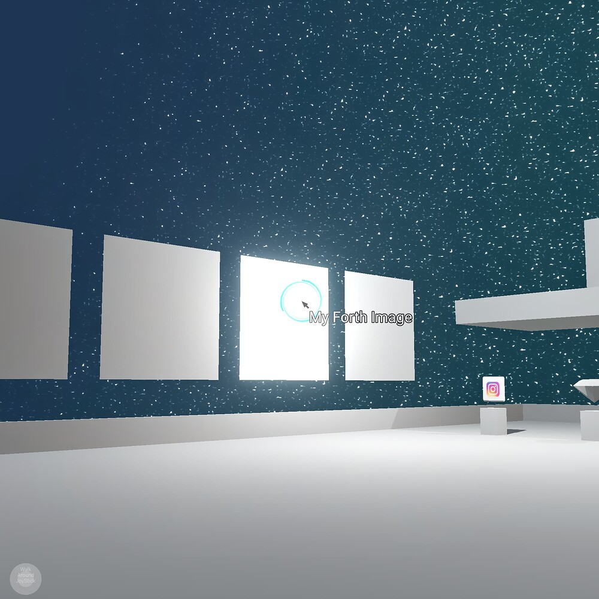
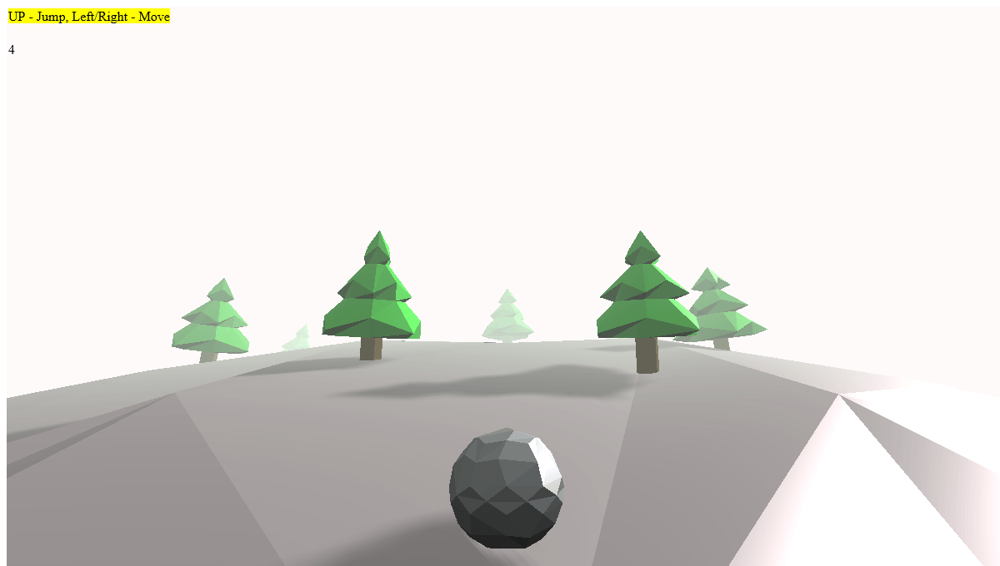
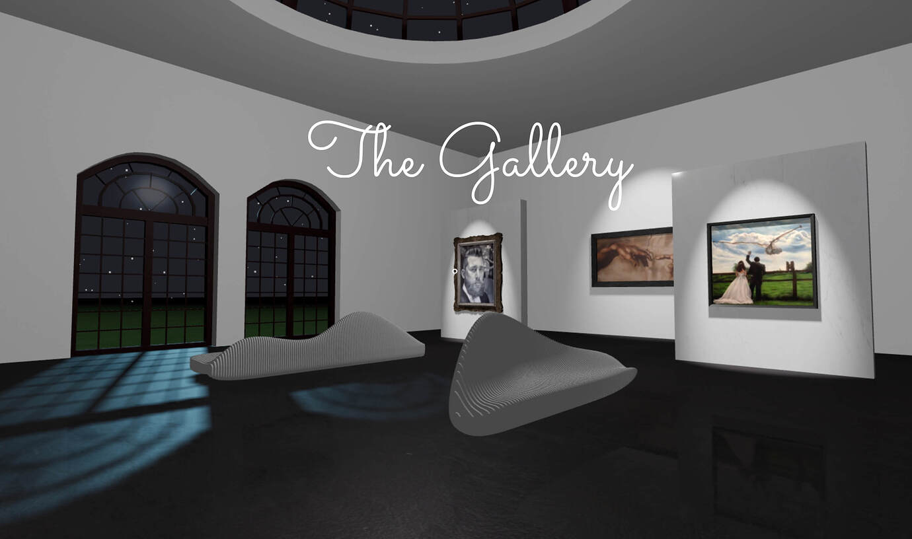
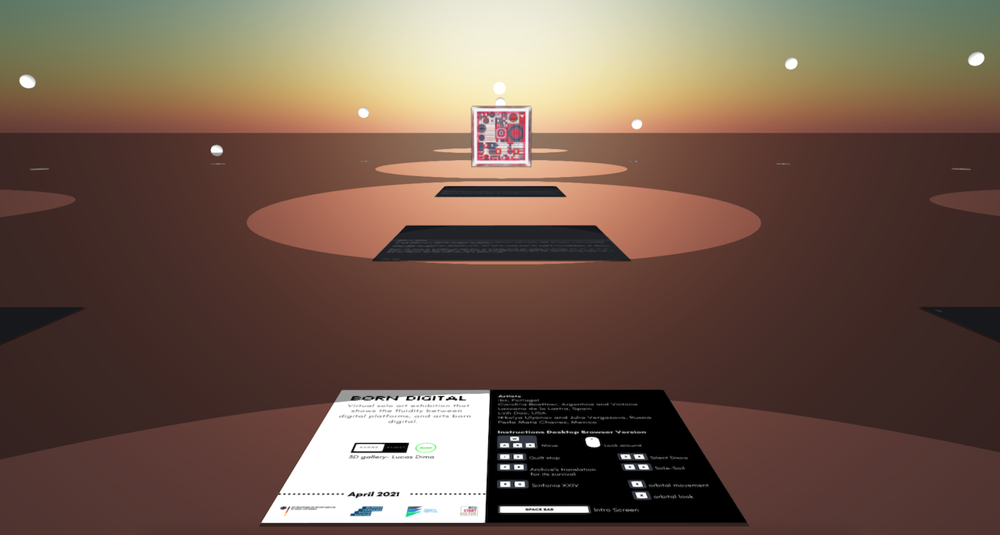

# Week12 Assignment - Jeongin Yoon

### Final Concept

##### I am planning to build a virtual environment (virtual gallery) using three.js. In the environment, users can interact with other objects in the scene (raycasting). Objects will consist of mesh or imported gltf assets (gsap to animate assets). I am going to use the first-person camera so it gives a Web VR type of experience. Below are inspired images.

##### Anticipated challenges can be the time we have left. If I face programmatic obstacles, I will try to make it work but I cannot try to solve the problem for a long time since we need to wrap it up in two weeks. In that case, the current plan might pivot due to time constraints. Before I start creating a scene and objects, I need to make sure what I can achieve or cannot achieve within the timeframe.

##### This week I will create the objects and environment. Next week I will add an interaction function with a mouse or keyboard.

